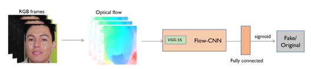
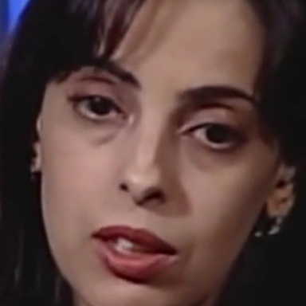
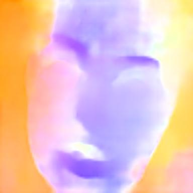
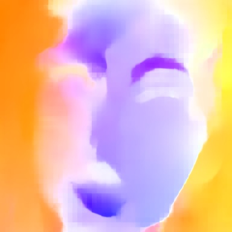
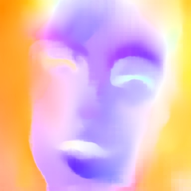

# DeepFakeDetectionOF

This repo contains the PyTorch implementation of the paper 'Deepfake Video Detection through Optical Flow based CNN'.

In this work, we train and evaluate the ResNet-50/VGG-16/ViT/DeiT models on the FaceForensics++ Dataset, which can be found [here](https://github.com/ondyari/FaceForensics).

---

<p align="center"><b>Main algorithm</b></p>
<p align="center">
  
</p>

---

<table align="center">
<tr>
  <td> 
    <p align="center">
      
      <br>
      <em style="color: grey">RGB image</em>
    </p> 
  </td>
  <td> 
    <p align="center">
      
      <br>
      <em style="color: grey">Optical Flow | PWC | 2017</em>
    </p> 
  </td>
  <td> 
    <p align="center">
      
      <br>
      <em style="color: grey">Optical Flow | RAFT | 2020</em>
    </p> 
  </td>
  <td> 
    <p align="center">
      
      <br>
      <em style="color: grey">Optical Flow | GMA | 2021</em>
    </p> 
  </td>
</tr>
</table>

---

## Installation (locally)

In order to run the notebook locally, make sure to meet the following library requirements:
- tqdm
- gdown
- cv2
- timm
- transformers
- torch

You can install them through:
```
pip install -U tqdm gdown opencv-python timm transformers
```
Refer to the [PyTorch website](https://pytorch.org/get-started/locally/) for local installation of PyTorch.

For Optical Flow algorithms, we used the [Sniklaus](https://github.com/sniklaus/pytorch-pwc) and [Hmorimitsu](https://github.com/hmorimitsu/ptlflow) repos for Optical Flow Estimation.

---

## Usage
Simply, run any notebook inside the ```training models``` directory.
You can choose between:
- ```training models/resnet.ipynb``` (Runs the algorithm through the ResNet-50/152 model)
- ```training models/vgg16.ipynb``` (Runs the algorithm through the VGG16 model)
- ```training models/Transformers.ipynb``` (Runs the algorithm through the ViT or DeiT model)

## Results
As for the results, we have a [table](https://github.com/SlimShadys/DeepFakeDetectionOF/blob/main/training%20models/README.md) in the ```training models``` directory, summing up all the results we had.

## Team Members


<a href="https://github.com/SlimShadys" style="margin-left: 10px; line-height: 50px; text-decoration: none;">
    <b>Gianmarco Scarano</b>
</a>
<br>
<br>
<br>

<a href="https://github.com/D-dolo" style="margin-left: 10px; line-height: 50px; text-decoration: none;">
    <b>Giancarlo Tedesco</b>
</a>
